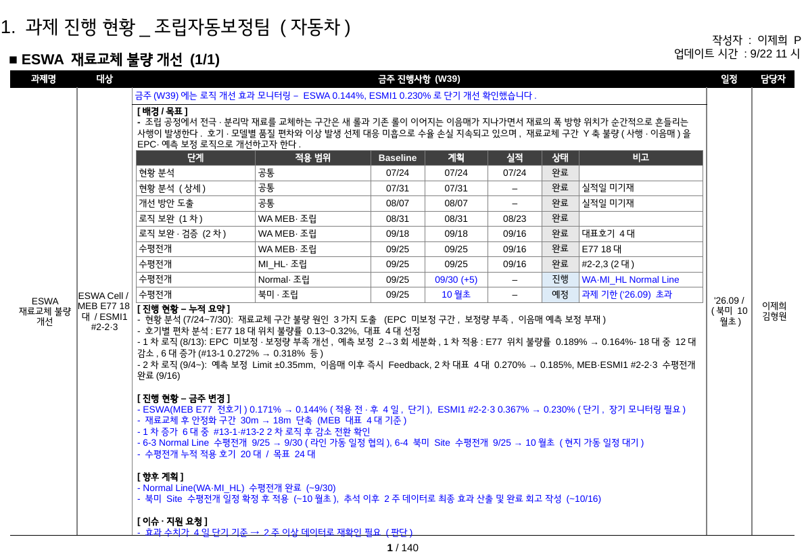
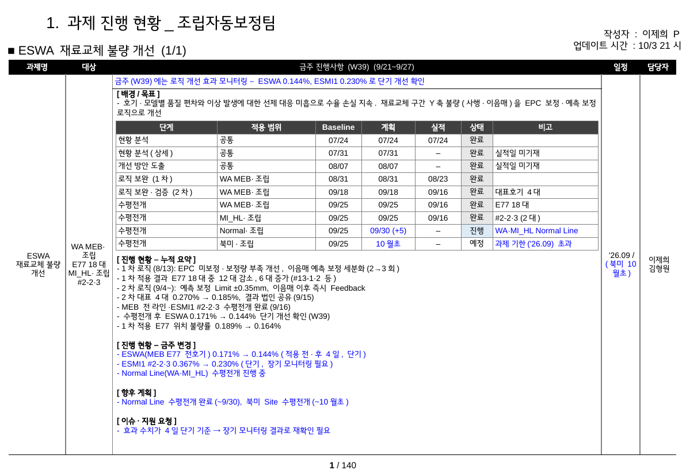

# 완성 예시 PPT 대비 디자인 기준 검토 (2026-10-03)

비교 대상: `완성 예시 PPT.pptx`(사람이 만든 W39 결과물)와 pptgen 생성본(P-ASM-001 / 2026-W39 mock).

방법은 두 가지다.
- 두 파일의 XML을 덤프해 도형·표·글자 서식(크기·굵기·ea/latin·색)과 칸 배경을 비교했다.
- LG스마트체를 넣은 같은 조건으로 렌더링해 겉모습을 비교했다(`python -m weekly_report preview`).

| 완성 예시 | 생성본 |
|---|---|
|  |  |

> 렌더링은 LibreOffice로 했다. 한글은 LG스마트체, 영문은 Arial Narrow 대신 같은 폭 비율(82%)의 Liberation Sans를 썼다.

## 1. 일치 — 현재 기준 유지

| 항목 | 완성 예시 | 기준·생성본 |
|---|---|---|
| 양식 | 10.83×7.5in, 도형 이름·위치 동일 | 동일 (템플릿 v2 그대로) |
| 표 구조 | main_table 3×5, ms_table 7열, 행 높이 0.205in | 동일 |
| 글자 | 본문 9pt, 제목 18pt, 과제명 14pt 굵게, 작성자 11pt | 동일 (템플릿 서식 복제) |
| 글꼴 | ea `LG스마트체 Regular`, latin 테마(+mn-lt = Arial Narrow), 굵게 = Regular + b | 동일 + latin `Arial Narrow` 명시 |
| 파란색 | headline, 금주·계획·이슈 항목, 6-3 계획·비고, 6-4 계획·비고 | 동일 (changed / milestone_updates 기준) |
| 상태 배경 | 완료 E7E7E7, 진행 DDEBF7 | 동일 |
| 계획 칸 | `09/30 (+5)`, `10월초` | 동일 (지연일은 코드 계산, plan_text 우선) |
| 적용 범위 | 공통 / WA MEB·조립 / MI_HL·조립 / Normal·조립 / 북미·조립 | 동일 (코드표 변환) |
| 본문 구성 | 누적 요약 → 금주 변경 → 향후 계획 → 이슈·지원 요청, 섹션 사이 빈 줄 | 동일 |
| 고정 사실 | 누적 요약에 "0.189% → 0.164%" 포함 | 동일 (빠진 고정 사실을 코드가 보충) |
| 과제 번호 | `(1/1)` | 동일 |

## 2. 예시가 기준을 어기는 부분 — 기준 유지

| 항목 | 완성 예시 | 판단 |
|---|---|---|
| 분량 | 배경/목표 4줄 + 표 10행 + 본문 22줄 = **36줄**. LG스마트체로 렌더링하면 마지막 줄이 표 하단 테두리에 닿음 | 36줄은 물리적으로 여유가 없는 상한이다. pptgen처럼 **물리 높이 검사를 함께** 하고, 넘치면 (계속) 장으로 보내는 방식이 맞다 |
| headline | "…단기 개선 확인했습니다." | 서술형 종결이라 common_rules 위반. 기준("~확인") 유지 |
| 예정 배경 | 6-4(예정) DDEBF7 | 진행과 같은 색이면 구분이 안 된다. **FFFFFF 유지**(결정) |
| 일정 병기 색 | 이번 주 바뀐 "(북미 10월초)"가 검정 | 템플릿 안내 "(변경 시 파란색)"에 따라 **파랑** |
| 항목 길이 | 한 항목이 한 줄 너비(가중 약 66자)까지 길어짐 | 40~60자·경어체·끝에 진행 날짜 (MM/DD)로 변경(2026-10-04, 그룹장 보고용·함축 방지). 줄 수 계산은 실측 폭(약 62자) 기준 |

## 3. 예시를 따라 기준을 바꾼 부분 (사용자 결정)

| 항목 | 이전 기준 | 변경 |
|---|---|---|
| 단계 이름 | `6-3. 수평전개` | **번호 없이** `수평전개` (접힌 행: `수평전개 완료 n개 사이트`) |
| 배경/목표 | `[배경] …` / `[목표] …` 두 줄 | `[배경/목표]` 굵은 제목 줄 + `- {배경}. {목적}` 한 문단(내용 최대 3줄) |
| 일정 칸 | `'26.09` | `'26.09 /` + 목표일을 넘는 미완료 단계 병기 `(북미 10월초)`. plan이 목표일보다 늦거나 plan_text의 "N월"이 목표 월보다 늦을 때만 넣는다(추정하지 않음) |
| 작성자·담당자 | 사용자 ID | `config/people.json` 매핑: "작성자 : 이제희 P", 담당자 "이제희 / 김형원"(owner + members). 매핑이 없으면 ID로 표시하고 경고 |
| 본문 항목 앞 표시 | ` - ` | `- ` (예시와 동일) |
| 업데이트 시각 | `18시` 두 자리 | `9시`처럼 앞자리 0 없이 (예시와 동일) |

## 4. 참고 — 차이를 문서로만 남김

| 항목 | 완성 예시 | 현재 처리 | 이유 |
|---|---|---|---|
| 슬라이드 제목 | "…조립자동보정팀 (자동차)" | 과제 구분 없음 | 이번 결정에서 제외(필요하면 target.usage → 코드표 product.usage로 rule 생성 가능) |
| 주차 머리글 | "금주 진행사항 (W39)" | "(W39)  (9/21~9/27)" | 템플릿 안내 문구(M/D~M/D) 기준 |
| 대상 칸 | "ESWA Cell / MEB E77 18대 / ESMI1 #2-2·3" | "WA MEB·조립 / E77 18대 / MI_HL·조립 / #2-2·3" | ESMI1은 미확정 코드(인터페이스 §8-6). 코드표 표기 유지 |
| 업데이트 시간 | 9/22 11시(Daily 수정 시각으로 보임) | weekly 생성 시각 | 정리본 기준 시각이 추적 가능 |
| 도형 간격 | 배경/목표·표·본문을 간격 없이 붙임 | 0.06in 간격 | 이번 결정에서 제외 |
| 내용 | 금주 변경 5항목(30m→18m 등), 배경 문장 보강 | mock 응답 3항목, 기준정보 문장 그대로 | 디자인이 아니라 입력 데이터 차이 |

## 5. LG스마트체 적용

TTF 4종을 fontTools로 확인한 실측값이다.

| 파일 | 이름(nameID 1) | 한글 폭 | 줄 높이(win) |
|---|---|---|---|
| LGSMHAR | **LG스마트체 Regular** | 0.891em | 1.085em |
| LGSMHAB | LG스마트체 Bold | 0.905em | 1.085em |
| LGSMHASB | LG스마트체 SemiBold | 0.898em | 1.085em |
| LGSMHAL | LG스마트체 Light | 0.884em | 1.085em |

- 템플릿·예시의 ea `LG스마트체 Regular`는 TTF 이름과 정확히 같다. 이 글꼴이 설치된 PC에서는 그대로 LG스마트체로 표시된다.
- **템플릿 테마(theme1.xml)의 ea는 `LG Smart Regular`로, 실제 글꼴 이름과 다르다.**
  ea를 따로 지정하지 않은 글자는 대체 글꼴로 나온다.
  → pptgen이 **출력 파일**의 테마 ea를 `LG스마트체 Regular`로 고친다. 원본 템플릿은 바꾸지 않는다.
- 모든 글자(제목·머리글·표·본문)의 ea가 `LG스마트체 Regular`인지 PPT 재검사로 확인한다.
- 표 칸 줄 수 계산에 실측 한글 폭 0.891em을 쓴다(글꼴 파일이 없으면 1.0em으로 보수적으로 계산).
- 가중치 "한글 1 : 영문·숫자 0.55"는 Arial Narrow 숫자 폭 / LG스마트체 한글 폭 ≈ 0.51보다 조금 보수적이다. 적절하다.
- PPTX 안에 글꼴을 넣지는(임베드) 않는다. fsType=8로 임베드는 허용되지만 python-pptx가 지원하지 않고, 사내 PC에 설치된 표준 글꼴로 보는 것을 전제로 한다.
- 글꼴 파일은 "ⓒ Copyright LG. All rights reserved"이므로 저장소 공개 범위를 확인해야 한다.

## 6. 분량 보정 (2026-10-03, W40 데모 결과 반영)

- W40 데모에서 마일스톤 표 9행 + 칸별 한도(누적 8, 금주 5, 계획 3, 이슈 2)를 모두 채우면 첫 장을 넘어 (계속) 장이 생겼다.
- 결정(2번 방식): 누적 요약 한도를 표 길이에 맞춰 줄인다. 첫 장에 남는 줄 수(최소 3·최대 8)를 주간 정리 단계 cumulative_update의 `max_items`로 넘긴다.
  프롬프트 v0.3에서는 "고정 사실의 핵심 수치는 items에 포함"을 추가했다.
- 줄 높이 보정: 1.2em → LG스마트체 1.17em. 근거는 LibreOffice 렌더링 실측 22줄 = 3.18in(1.156em)과 완성 예시 1.10em이다.
  본문 한 줄 폭은 실제 너비(한글 약 68자)의 92%로 계산한다. 도형 간격은 0.06in → 0.03in로 줄였다.
- 결과: W40 데모는 누적 요약 4개로 한 장에 들어가고, 하단에 여백이 남는다(demo/w40).
