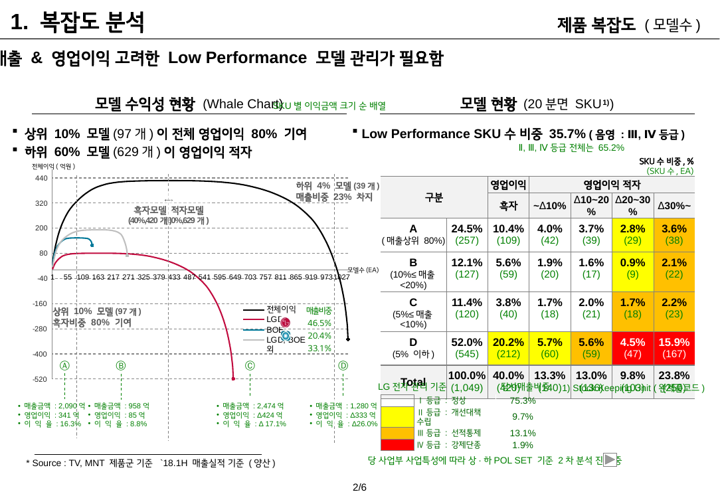
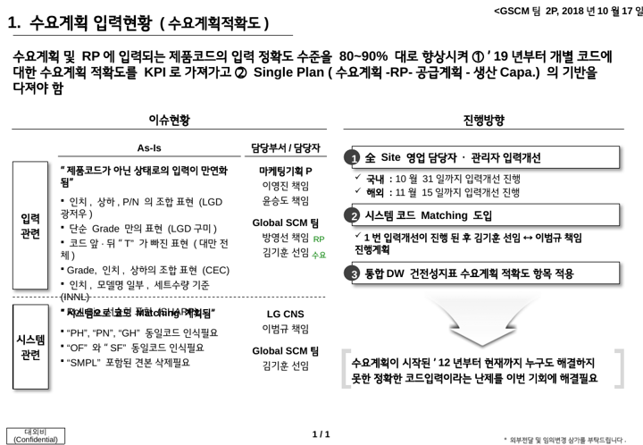
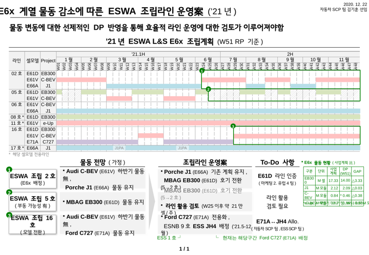
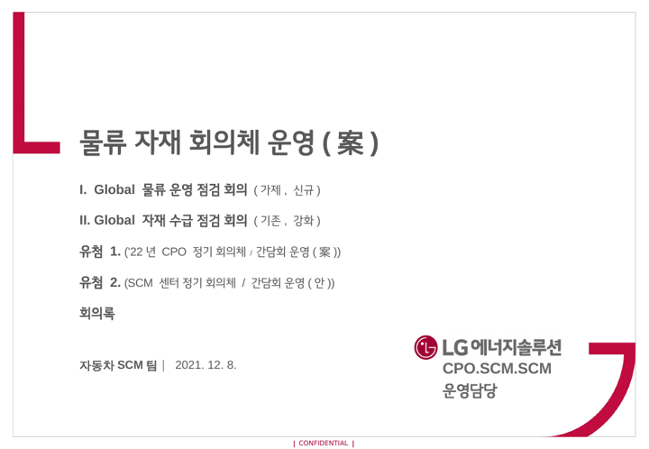
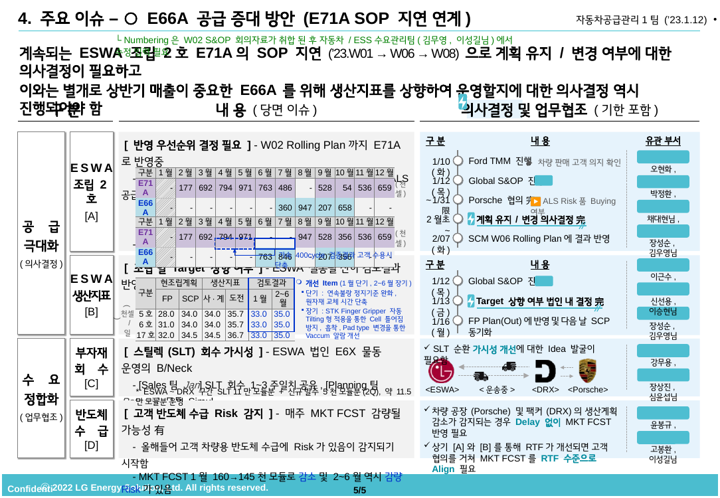
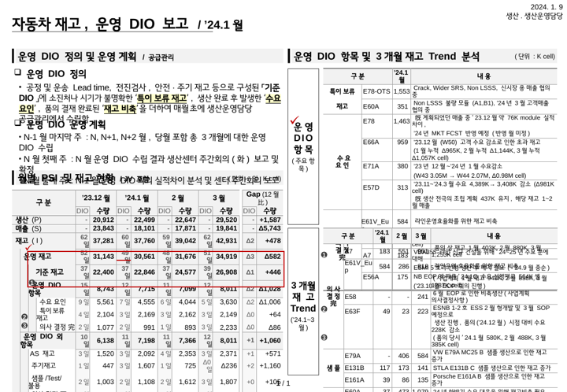
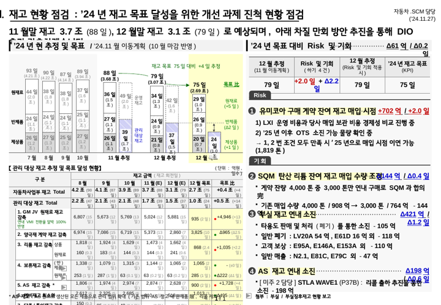
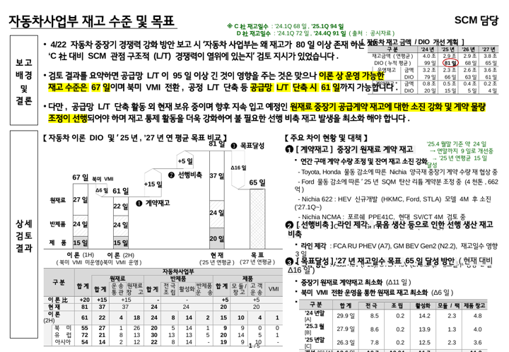
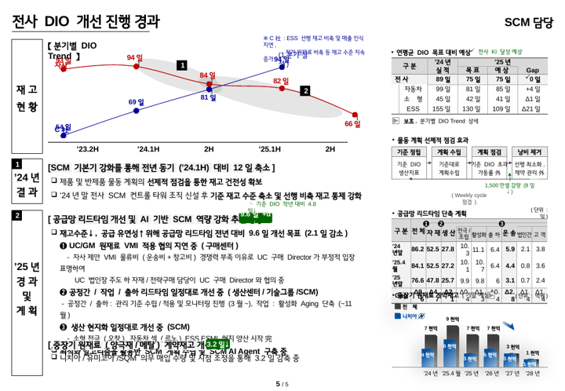
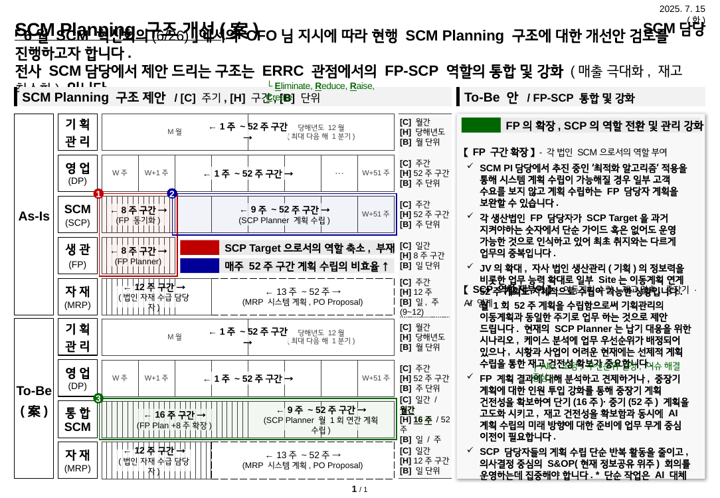

# 보고 자료 확장 검토: 장표모음집 분석 · Rule/EXAONE 역할 · 프롬프트 설계

> 작성 2026-10-04 · 대상 `260106_장표모음집_와꾸대장.pptx`(10장) · 설계 단계 (렌더러는 다음 단계)
> 이 문서와 같이 만든 것:
> - 프롬프트 초안 `prompts/report/`
> - 출력 형식 `schemas/report_*.schema.json`
> - 변수·검사 코드 `weekly_report/report_vars.py`
> - 예시 `docs/보고자료_예시/`

## 0. 결론 요약

1. **Rule + EXAONE 혼합을 권합니다.** Rule이 장표의 틀·표 숫자·일정·색을 맡고, EXAONE은 정해진 칸의 문장만 씁니다.
   - EXAONE이 쓰는 칸: 헤드메시지, 보고 배경·결론, 개조식 요약, 리스크·요청.
   - AI는 좌표나 서식을 내지 않습니다. 칸 ID별 `text + source_ids`만 냅니다.
   - 숫자·날짜·근거·분량·문체는 코드가 검사합니다. 실패하면 1회 재요청하고, 다시 실패하면 Rule 문장으로 대체합니다.
2. **피보고자가 선호하는 양식은 "한 장 결론형"입니다.**
   - 제목 바로 아래 전체 폭 헤드메시지(결론·수치·조치)를 둡니다.
   - 본문은 왼쪽 세로 라벨 띠로 행을 나누고, 표와 개조식 본문을 짝지어 놓습니다.
   - 수치는 항상 단위·기간·비교 기준과 함께 씁니다.
3. **문체(사용자 결정, 모음집 방식)**
   - 헤드메시지·결론: 경어체 완결문("~하겠습니다")
   - 본문: 개조식 + 기호("[ 소제목 ]", "-", "└", "完/限/比", "→")
   - 주간업무 PPT는 지금 방식(경어체)을 유지합니다.
4. 먼저 만들 보고 유형은 **월간 종합 보고(여러 과제)**와 **경영진 1장 요약**입니다. 장표 유형 4종(A~D)을 조합하는 구조라 다른 보고는 유형 조합만 정의하면 추가됩니다.

---

## 1. 장표모음집 10장 분석

python-pptx로 10장의 도형 위치·크기, 글자 크기·색, 표 구조를 모두 추출했고, LG스마트체로 렌더링해 확인했습니다.
아래 썸네일은 LibreOffice 렌더링이라 일부 글자가 겹쳐 보입니다. 원본에서는 정상입니다.

| # | 썸네일 | 주제·목적 | 구조 | 표·도형 활용 | 차용할 점 |
|---|---|---|---|---|---|
| 1 |  | 복잡도 분석 (현황 진단) | 제목 → 헤드메시지 → 2단(차트 \| 등급표) | 곡선 차트 + 히트맵 표(등급별 노랑/주황/빨강 음영), Ⓐ~Ⓓ 구간 표시, 녹색 주석 | 진단 장표는 **"데이터 1개 + 핵심 해석 1줄"**을 좌우에 대칭 배치 |
| 2 |  | 입력 정확도 개선 (이슈→방향) | 헤드메시지(①② 목표 포함) → 2단: 이슈현황(As-Is·담당) \| 진행방향(①②③ 단계) → 하단 결론 박스 | 세로 라벨(입력 관련/시스템 관련), 번호 원형 배지, 화살표 | **이슈 \| 담당 \| 방향** 3열, 결론을 큰 괄호 박스로 강조 |
| 3 |  | 라인 운영案 | 헤드메시지 → 주차별 간트 표(W01~W48) → 3열 흐름(물동 전망 → 운영案 → To-Do) + 우측 GAP 표 | 간트 막대 색 = 모델, 녹색 테두리로 변경 구간, ①②③ 배지로 간트↔본문 연결 | **마일스톤/간트 + 행별 결론** 구조. 과제 일정 보고에 그대로 응용 가능 |
| 4 |  | 표지 | 제목 32pt + 목차 + 부서·날짜 | — | 월간 보고 표지가 필요할 때 |
| 5 |  | 주요 이슈·의사결정 | 헤드메시지(의사결정 필요 2건) → 3열: 구분 \| 내용(당면 이슈) \| **의사결정 및 업무협조(기한 포함)** | 이슈별 [A]~[D] 태그, 일정 "1/10(화)" + 내용 + 유관부서 칩·담당자, 完 표시, 파란 강조 | **요청·결정 장표의 표준**: 무엇을, 언제까지, 누가(부서) |
| 6 |  | DIO 정의·현황 | 2단: 정의·운영 계획(❑ 소제목) \| 항목별 표(구분·수량·내용) + 하단 PSI 표 | 굵은 세로바 섹션 헤더, 노랑 형광 강조, 빨간 박스로 핵심 행 표시 | 섹션 헤더 "▌제목 / 부제"와 **표 안 핵심 행 박스** |
| 7 |  | 재고 목표 진척 점검 | 헤드메시지(수치 + "~감축하겠습니다") → 2단: 누적 막대 \| Risk/기회 ❶~❹ | 우측 정렬 영향 금액 "+702억 / +2.0일", 증가 빨강·감소 파랑, 목표比 열 | **과제별 진척 + 영향 수치 우측 정렬**: 월간 종합 보고의 기본형 |
| 8 |  | 재고 수준·목표 (경영진 보고) | 세로 라벨 2행: **보고배경 및 결론**(경어체 3문장, 형광 강조) \| **상세검토결과**(차트 + ❶❷❸ 대책 + 표) | 우상단 소형 KPI 표, 핵심 숫자 노랑 형광, 원형 표시 | **경영진 1장 요약의 기본형** |
| 9 |  | DIO 개선 경과 | 세로 라벨 3행(재고 현황 / ’24년 결과 / ’25년 경과 및 계획) + 우측 KPI·계획 표 | 추이 곡선, [1][2] 검정 사각 배지, ❑ 소제목, Gap 열 | **기간별 행 구성(결과 → 경과 → 계획)** |
| 10 |  | 구조 개선(案) | 헤드메시지(지시 배경 + 제안, 경어체) → As-Is/To-Be 세로 라벨 \| 우측 제안 상세 | 1x1 표로 만든 구간 블록, 빨강/파랑 테두리 비교 | 변경 제안은 **As-Is ↔ To-Be 대칭** |

### 1.1 공통 디자인 규칙 (피보고자가 익숙한 형식)

| 항목 | 규칙 (모음집 실측) |
|---|---|
| 크기·글꼴 | 10.83×7.5in. 국문 LG스마트체 Regular(5,911회)·영문 Arial Narrow(5,858회)로 **주간 템플릿과 같음** |
| 제목 | 좌상단 (0.2, 0.2)in, 18~20pt 굵게, 번호 "1. ", 부제는 " / ’24.1월" 형태 |
| 작성 정보 | 우상단 9~12pt: "SCM담당", "자동차.SCM담당(’24.11.27)", "2025. 7. 15(화)" |
| 헤드메시지 | 제목 아래 (0.2, 0.6~0.8)in, **전체 폭 10.3in**, 14~16pt 굵게, 1~3줄. 결론·핵심 수치·다음 조치를 한 문단에 |
| 본문 구획 | ① 왼쪽 **세로 라벨 띠**(폭 0.6in, 13~14pt 굵게, 음영, 글자 사이 띄움 "보 고 배 경")로 행 구분, ② 2단(5.1~5.3in씩), ③ 섹션 헤더 = 14pt 굵게 + 아래 밑줄 또는 왼쪽 굵은 세로바 |
| 본문 글자 | 10.5~12pt (주간 9pt보다 큼). 소제목 "[ 소제목 ]" 굵게, 하위 "- ", 부연 "└ ", 주석 "※ " |
| 표 | 9~10pt, 머리행 음영, 우상단 "(단위 : 억원, 일수)", 계획·실적·**GAP/목표比** 열, 음수 "Δ", 수치 가운데·오른쪽 정렬 |
| 색 의미 | 검정 = 본문 / **빨강 C00000 = 악화·증가·Risk** / **파랑 0000CC = 개선·감소** / **녹색 008000·006600 = 보조 설명·주석·콜아웃(8~10pt)** / 노랑 형광 = 결론 핵심 구절 |
| 번호 연결 | ①②③ 원형 배지(녹색 바탕 흰 글자) 또는 ❶❷❸, [A][B]: 표·차트의 위치와 본문 설명을 같은 번호로 연결 |
| 하단 | 가운데 "1 / 1" 쪽 번호, 좌하단 "대외비", 우하단 "* 외부전달 및 임의변경 삼가" |
| 피하는 것 | 장식용 그림·아이콘(5번에는 장표 밖 아이콘 모음을 따로 둠), 3색 넘는 강조, 결론 없는 데이터 나열 |

### 1.2 글의 톤과 내용 구성

- **결론 먼저.** 모든 장표가 제목 아래에 "그래서 무엇인지"를 먼저 씁니다.
  - 7번: "11월말 재고 3.7조 (88일), 12월말 재고 3.1조 (79일) 로 예상되며, 아래 차질 만회 방안 추진을 통해 DIO 추가 감축하겠습니다."
- **헤드메시지 문체는 최근 장표일수록 경어체입니다.**
  - ’18~’21년: "~필요함", "~이루어져야함"
  - ’24~’25년: "~하겠습니다", "~진행하고자 합니다", "~검토 지시가 있었습니다"
- **본문은 개조식입니다.** 명사형으로 끝내고, 完·限·有/無·比·案, ↑↓, → 를 씁니다. 수치에는 기간·기준을 붙입니다. 예: "(W51 RP 기준)", "(’24.11월 이동계획)".
- **수치 표기**
  - 절대값과 비교를 함께 씁니다: "3.7조 (88일)", "목표 75일 대비 +4일".
  - 변화 경로를 이어 씁니다: "’23.W01 → W06 → W08".
- **의사결정 요청**은 일정(요일 포함)·내용·유관부서·담당자를 한 줄에 둡니다(5번).
- **출처·전제**는 녹색 소형 주석으로 붙입니다: "* Source : …", "※ C社 : …".

---

## 2. Rule 기반 vs EXAONE 재정리 검토

### 2.1 근거: 실제 EXAONE 응답(`Example`, 2026-10-04)

프롬프트 v0.5는 40~60자·경어체·끝에 "(MM/DD)" 날짜를 요구했습니다. 실제 응답은 다음과 같았습니다.

| 항목 | 응답 | 문제 |
|---|---|---|
| items[0] | "ESWA 2차 로직, 0.171%→0.144%(4일)·0.139%(2주) 개선. (09/04-09/28)" | 약 35자(최소 40자 미달), 경어체 아님, 날짜 범위를 "-"로 씀 |
| items[2] | "#13-2 EPC 조치, N.Line 6대·MEB·ESMI1 개선. (10/02~10/08)" | 함축 표기(N.Line), 무엇을 개선했는지 불명확 |
| 이전 응답 | 문장 앞에 "(P-ASM-001)"을 붙임 | 프롬프트 입력 형식을 그대로 따라 씀(현재는 코드가 떼어 냄) |

수치·근거 ID는 대체로 지켰습니다. 반면 **형식·분량·문체 규칙은 자주 어깁니다.** 따라서 형식은 코드가 책임져야 합니다.

### 2.2 방식 비교

| 기준 | Rule만 | EXAONE이 장표 전체 재구성 | **혼합 (권장)** |
|---|---|---|---|
| 숫자·일정 정확성 | 높음 | 낮음 (환각·계산 오류) | 높음: 숫자는 Rule, AI 문장의 숫자는 검증 |
| 양식 준수(위치·색·글꼴) | 높음 | 낮음: AI가 좌표·서식을 지키지 못함 | 높음: 양식은 Rule 고정 |
| "그래서 무엇인지" (여러 주·과제 종합) | **낮음**: 문장 이어 붙이기에 그침 | 높음 | 높음: 헤드메시지·결론은 AI |
| 실패 시 | — | 장표 전체가 무너짐 | 칸 단위 재요청 → 원문 대체 |
| 검증 | 불필요 | 어려움 | 기존 검증기 재사용(`validate.check_item`, `ai.read_payload`) |

### 2.3 역할 분담

| 영역 | 담당 | 데이터 출처 |
|---|---|---|
| 장표 유형 선택·배치·도형·색·글꼴 | Rule | 보고 종류별 고정 구성(3장) |
| 과제 현황표: 과제명·상태·건강도·목표 일정·지연 단계(+n일)·KPI 기준→최신 | Rule | `data/master/projects/*.json` + 주간 일정 변화 덧씌움(`ppt/milestones.apply_history`) |
| 마일스톤 표·간트 | Rule | 위와 같음 (주간 PPT 로직 재사용) |
| 증감·GAP·목표比 계산과 색(빨강/파랑) | Rule | KPI baseline·target·actuals, direction(up/down) |
| 헤드메시지, 보고 배경 및 결론 | **EXAONE** | weekly·cumulative·기준정보 (프롬프트 입력) |
| 과제별 한 줄 코멘트, 주요 성과, 리스크·대응, 요청 | **EXAONE** | 같음 |
| 강조(형광) 구절 선택 | EXAONE 제안 → Rule 검사(문장에 그대로 있는 구절만) | |
| 검증 | Rule | 수치·날짜·근거 ID(`check_item`), 분량·문체·강조(`report_vars.report_style_problems`), 형식(JSON Schema) |

---

## 3. 장표 유형(Archetype) 4종

모든 보고는 아래 유형의 조합으로 만듭니다. 칸 ID = 렌더러가 찾을 도형 이름이자 AI 출력 JSON의 키입니다.

| 유형 | 모음집 근거 | 배치 (in, 10.83×7.5) | 칸 ID (Rule/AI) |
|---|---|---|---|
| **A. 헤드메시지 + 세로 라벨 띠** | 8, 9, 2 | 제목 (0.2,0.2) · 헤드메시지 (0.2,0.6) 10.3×0.6 · 띠1 라벨 (0.2,1.3) 0.6×1.9 + 내용 9.7폭 · 띠2 (0.2,3.3)~(7.1) 좌우 2단 | title(AI), head_message(AI), band1_label(Rule), background_conclusion(AI), band2_label(Rule), left_title/left_items(AI), right_title/right_items(AI), kpi_table(Rule), ms_table(Rule) |
| **B. 2단 현황 \| 대책** | 2, 6, 10 | 헤드메시지 아래 좌우 5.1in씩, 각 단 헤더 14pt + 밑줄 | head_message(AI), left_header/right_header(Rule), left_items/right_items(AI), 표(Rule) |
| **C. 이슈·의사결정 표** | 5 | 구분 1.4 \| 당면 이슈 4.4 \| 의사결정·업무협조 4.2 (일정·내용·유관부서) | head_message(AI), issue_rows[].label(Rule: 과제명), issue_rows[].text(AI), requests[].text(AI), due·dept(입력에 있을 때만) |
| **D. KPI·진척 표 + 코멘트** | 7, 9 | 헤드메시지 아래 전체 폭 표: 과제 \| 상태 \| 목표 일정 \| KPI(기준→최신, 목표比) \| 이번 달 주요 내용 · 하단 성과/리스크 2단 | project_table(Rule), project_comments[](AI, 표 마지막 열), highlights/risks(AI) |

### 3.1 칸별 분량 (가중 글자 수: 한글 1, 영문·숫자 0.55)

LG스마트체 한글 폭 0.891em(굵게 0.905em)으로 칸 너비에서 계산했습니다. 값은 `weekly_report/report_vars.py`의 `MONTHLY_BUDGET`·`EXEC_BUDGET`에 있습니다.

| 칸 | 글자 크기 | 한 줄 | 분량 |
|---|---|---|---|
| title | 20pt 굵게, 7in | 약 28자 | 30자 |
| head_message | 16pt 굵게, 10.3in | 약 51자 | 2줄, 100자 |
| background_conclusion | 13pt 굵게, 9.7in | 약 59자 | 문장 3개 × 110자(2줄) |
| 본문 항목 (2단 한쪽) | 11pt, 4.6in | 약 34자 | 항목 60자(2줄 이내) · 왼쪽 6개 · 오른쪽 5개 |
| 과제 코멘트 (표 열) | 10pt, 약 2.4in | 약 19자 | 40자(2줄) |

---

## 4. 보고 유형별 구성

### 4.1 월간 종합 보고 (여러 과제)

- 대상: 팀·그룹의 과제 전체, 해당 월의 ISO 주차(목요일 기준, 예: ’26.10월 = W40~W44)
- 구성: 표지 없이 2~3장

| 장 | 유형 | 내용 | Rule | AI |
|---|---|---|---|---|
| 1 | D | 헤드메시지 + 과제 현황표 + 주요 성과 \| 리스크 및 대응 | 과제명·상태·건강도(색)·목표 일정·지연 단계(+n일)·KPI 기준→최신·목표比 | head_message, project_comments, highlights(≤4), risks(≤3) |
| 2 | A 또는 B (과제당 1개 행 띠) | 과제별 진척: 마일스톤 미니 간트 + 개조식 2~3줄 | 마일스톤·간트(주간 PPT 로직) | (2단계) 과제별 요약 칸 추가 예정 |
| 3 | C (요청이 있을 때만) | 의사결정 및 업무협조 | 과제명, 유관부서 칩 | requests(≤3, 기한·부서는 입력에 있을 때만) |

- 프롬프트: `prompts/report/report_monthly.*.txt`
- 출력 형식: `schemas/report_monthly.schema.json`
- 예시: `docs/보고자료_예시/report_monthly__프롬프트.txt`(데모 데이터로 만든 실제 프롬프트), `report_monthly__예시응답.json`

### 4.2 경영진 1장 요약 (과제 1개)

| 위치 | 유형 A 칸 | Rule | AI |
|---|---|---|---|
| 제목·작성 정보 | title, 우상단 부서·날짜 | 부서·날짜 | title |
| 헤드메시지 | head_message | — | 경어체 1~2문장 |
| 띠1 "보고 배경 및 결론" | background_conclusion ×3 + emphasis | 라벨, 형광 적용 | 경어체 3문장(배경 / 결론 수치 / 남은 과제·조치), 강조 구절 |
| 띠2 "상세 검토 결과" 왼쪽 | left_title, left_items | 우상단 KPI 표(기준→최신, 목표比 색) | 추진 경과 및 성과(개조식 ≤6) |
| 띠2 오른쪽 | right_title, right_items | 마일스톤 요약 표(남은 단계만) | 향후 계획 및 요청(≤5, "▶ 요청: ") |

- 프롬프트: `prompts/report/report_exec_summary.*.txt`
- 출력 형식: `schemas/report_exec_summary.schema.json`
- 예시: `docs/보고자료_예시/report_exec_summary__*.{txt,json}`

---

## 5. EXAONE 프롬프트 설계

### 5.1 구성

```
prompts/report/
  report_common_rules.txt        보고 자료 공통 규칙 (모음집 문체) → {{report_rules}}
  report_monthly.system.txt      월간 종합: 칸별 작성 규칙 + 출력 JSON
  report_monthly.user.txt        월간 종합: 과제 목록(Rule 값) + 주간 정리본 + 누적 요약
  report_exec_summary.system.txt 1장 요약: 칸별 작성 규칙 + 출력 JSON
  report_exec_summary.user.txt   1장 요약: 기준정보·KPI·마일스톤·누적·고정 사실·최근 4주
```

변수는 `weekly_report/report_vars.py`가 만듭니다(`monthly_variables`, `exec_variables`, `render_report_prompt`).
주간 프롬프트와 같은 `{{변수}}` 치환을 쓰며, 코드에 프롬프트 문장을 하드코딩하지 않습니다.

### 5.2 프롬프트 작성 원칙

| 원칙 | 프롬프트 표현 | 이유 |
|---|---|---|
| 결론 먼저 | "헤드메시지는 현재 상태 + 핵심 수치 + 다음 조치(또는 요청) 순서" | 모음집 전 장표가 이 구조 |
| 칸마다 문체 지정 | head_message·background_conclusion = 경어체 완결문, 그 외 = 개조식 | 사용자 결정(모음집 방식). 칸 단위로 지시해야 섞이지 않음 |
| 숫자는 옮기기만 | "반올림·환산·증감 계산을 하지 않는다. 계산값은 코드가 표에 넣는다" | AI 계산 오류 방지, 검증 가능성 |
| 표 값은 AI에 맡기지 않음 | 입력에 "과제 목록 (코드가 표에 넣는 값)"으로 따로 줌 | AI는 문장에서 참고만 하고 표는 Rule이 채움 |
| 근거 분리 | 입력은 "문장  [근거: ID]", 출력은 source_ids | 문장에 ID가 섞이는 문제(실제 발생) 방지 |
| 분량은 숫자로 | "{{head_max}}자 이내", "최대 {{left_max_items}}개" | 칸 크기에서 계산한 값을 변수로 전달 |
| 표기법 사전 | "[ 소제목 ]", "- ", "└ ", "※ ", "이전 → 이후", 完·限·有/無·比·案 | 회사 관례를 고정. 남용 금지("필요할 때만") |
| 판단 구분 | "(판단)" + 같은 문장에 근거 사실 | 경영진 보고에서 사실/의견 혼동 방지 |
| 우선순위 | 마일스톤 완료·지연 → KPI 결과 → 의사결정 이슈 → 다음 계획 | 항목이 넘칠 때 AI의 선택 기준 |
| 출력 형식 고정 | 마지막에 출력 JSON 예시, "JSON만" | `ai.read_payload`가 감싼 객체·설명 문장도 처리 |

### 5.3 실패 처리 (코드)

1. `ai.read_payload`가 JSON을 꺼내고 형식을 정리합니다.
   - 설명 문장이나 ```` ```json ```` 블록이 섞여 있어도 JSON 부분만 꺼냅니다.
   - 한 겹 감싼 객체를 풀고, 문장 앞에 붙은 근거 ID를 떼어 냅니다.
2. `schemas/report_*.schema.json`으로 구조를 검증합니다.
3. 의미를 검증합니다.
   - `validate.check_item`: 수치·날짜·근거 ID가 입력에 있는지
   - `report_vars.report_style_problems`: 칸별 분량, 경어체/개조식, 강조 구절이 문장에 있는지
4. 처리 방식 (구현: `weekly_report/report/checks.py`)
   - **형식 오류**(필수 칸 없음 등): live 모드는 이유를 붙여 1회 재요청합니다(`ai.ExaoneClient`). 웹 붙여넣기는 저장을 거부하고 이유를 보여 줍니다.
   - **의미·문체 오류**: 재요청하지 않습니다. 그 칸만 Rule 값으로 대체하고, 목록 칸은 그 항목만 뺍니다.
     - 헤드메시지 → "OO 과제의 진행 현황을 보고드립니다."
     - 과제 코멘트 → "주간 정리본 참조"
     - 좌측 성과 → 누적 요약 문장, 우측 계획 → 최신 주간 계획 문장
   - 무엇을 대체했는지는 `*_check.txt`에 `[대체]`로 남깁니다.
   - 의미 오류 재요청은 실제 EXAONE 응답 품질을 본 뒤 결정합니다.
5. 프롬프트 버전은 `prompts/report/README.md`로 관리하고, 결과 파일에 함께 기록합니다(주간과 같은 방식).

### 5.4 EXAONE에서 직접 시험하는 법

1. `docs/보고자료_예시/report_*__프롬프트.txt`를 그대로 복사해 EXAONE에 보냅니다. 데모 데이터(P-ASM-001, ’26.10월)로 만든 것입니다.
2. 받은 JSON을 `report_*__예시응답.json`과 비교합니다.
3. 받은 응답을 `answer.json`으로 저장하고 아래처럼 검사합니다. 렌더러 단계에서 웹 화면 붙여넣기 흐름에 연결할 예정입니다.

```python
from pathlib import Path
from weekly_report.ai import read_payload
from weekly_report.report_vars import report_style_problems

payload = read_payload(Path("answer.json").read_text(encoding="utf-8"), "report_exec_summary")
print(report_style_problems("report_exec_summary", payload) or "분량·문체·강조 통과")
```

---

## 6. 구현 현황 (2026-10-04, 초안)

| 항목 | 위치 | 상태 |
|---|---|---|
| 템플릿 초안 | `보고자료_Template_v1_초안.pptx` (생성: `python tools/make_report_template.py`) | 3장: ① exec_summary(유형 A) ② monthly_overview(유형 D) ③ monthly_requests(유형 C). 하단에 "초안 – 공식 양식 아님" 표시 |
| Rule 값 | `weekly_report/report/content.py` | KPI 기준→최신·변화량(Δ, %p, 개선 파랑/악화 빨강), 지연 단계(+n일), 상태·건강도 칸 색, 담당자 이름 |
| 응답 검사·대체 | `weekly_report/report/checks.py` | 스키마 → 수치·날짜·근거(입력 프롬프트 전체가 근거) → 분량·문체·강조 |
| 렌더러 | `weekly_report/report/render.py` | 칸 이름으로 채움, 표 행 복제·줄 수로 높이 계산, 과제가 많으면 "(계속)" 장, 요청 없으면 ③ 생략, 쪽 번호, 재검사(ea 글꼴·영역·글 분량) |
| 생성 | `weekly_report/report/generate.py` | `generate_exec_summary`, `generate_monthly` |
| CLI | `python -m weekly_report report exec P-ASM-001 2026-W40` / `report monthly 2026-09` | mock 응답이 없으면 파일 이름을 알려 줌 |
| 웹 | ② 카드의 "보고 자료 생성" | 주간과 같은 흐름: 프롬프트 표시 → 응답 붙여넣기(형식 검사) → PPT·검사 보고서 |
| 데모 | `python demo/report/run_report_demo.py` → `demo/report/out/` | 경영진 1장 요약(P-ASM-001, W40), 월간 종합(’26.9월, 6개 과제: P-ASM-001 + 합성 5과제) |

남은 일
- **사용자 검토:** 템플릿 초안 배치·글자 크기·색. 공식 양식이 정해지면 같은 도형 이름으로 교체하면 됩니다.
- **월간 2장(과제별 진척 띠):** 설계 4.1의 2장은 아직 만들지 않았습니다. 현재 월간 보고는 1장(현황표·성과·리스크)과 3장(요청)으로 구성됩니다.
- **실제 EXAONE 시험:** 웹 화면의 프롬프트를 EXAONE에 보내 응답 품질을 확인하고, 대체가 잦은 칸의 프롬프트를 고칩니다.
- 다른 보고 유형("기타")은 유형 A~D 조합으로 추가합니다(예: 과제 완료 보고 = A + 간트).
